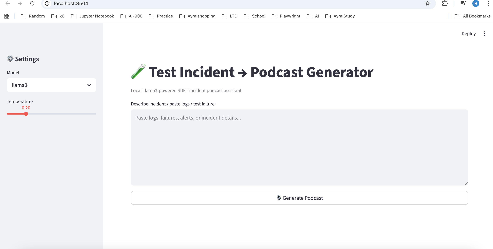

# 🧪 Incident Podcast Agent

Paste a production incident and get back a structured SDET postmortem analysis — narrated as audio.

Built for testers and SDETs who want a fresh perspective on incidents beyond what the dev team sees.

---



---

## 🔍 What It Does

Takes raw incident data — logs, alerts, failure descriptions — and generates a realistic engineering
discussion between two SDETs analysing what went wrong, what was missed, and how to prevent it.

Output is both a written structured report and a narrated audio podcast. Think of it as a second
opinion from an SDET who wasn't in the room when the incident happened.

---

## 💡 Why It's Useful

- **Different perspective** — simulates how an SDET would investigate the incident, not just the team that built it
- **Catches blind spots** — surfaces bottlenecks and missing test coverage you might overlook reading logs alone
- **Audio support** — review the postmortem without staring at a screen
- **Structured output** — root cause, prevention plan, and recommended tests every time
- **Fully local** — no API keys, no cloud, no cost

---

## ✅ Requirements

- Python 3.9+
- [Ollama](https://ollama.ai) installed and running locally
- LLaMA 3 model pulled

---

## 🛠️ Setup

```bash
# 1. Clone the repo
git clone https://github.com/yourusername/incident-podcast-agent.git
cd incident-podcast-agent

# 2. Create and activate a virtual environment
python -m venv venv
source venv/bin/activate        # Mac/Linux
venv\Scripts\activate           # Windows

# 3. Install dependencies
pip install -r requirements.txt

# 4. Pull the model
ollama pull llama3
```

---

## 🚀 Run

```bash
streamlit run incident_podcast.py
```

Then open [http://localhost:8501](http://localhost:8501) in your browser.

---

## ⚙️ Features

| Setting | Options | What It Does |
|---|---|---|
| Model | llama3, llama3:70b, mistral, qwen2.5 | Choose which local LLM analyses the incident |
| Temperature | 0.0 – 1.0 | Lower = more focused, Higher = more creative output |
| Voice | US, British, Australian (male/female) | Choose the narrator voice for the podcast |

---

## 🎙️ How To Use

1. Choose your model, temperature, and voice from the sidebar
2. Paste your production incident — logs, alerts, error messages, or a plain description
3. Hit **Generate Podcast**
4. Read the structured report or listen to the audio narration
5. Download the report as a markdown file

---

## 🧰 Tech Stack

| Tool | Purpose |
|---|---|
| [LLaMA 3](https://ollama.ai) via Ollama | Local LLM — no API key needed |
| [edge-tts](https://github.com/rany2/edge-tts) | Free neural text-to-speech — no API key needed |
| [Streamlit](https://streamlit.io) | UI |

---

## 💬 Inspiration

Inspired by the blog-to-podcast pattern — adapted for Test incident analysis.